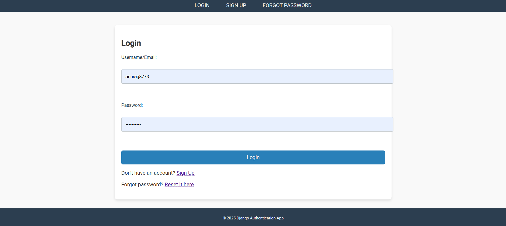
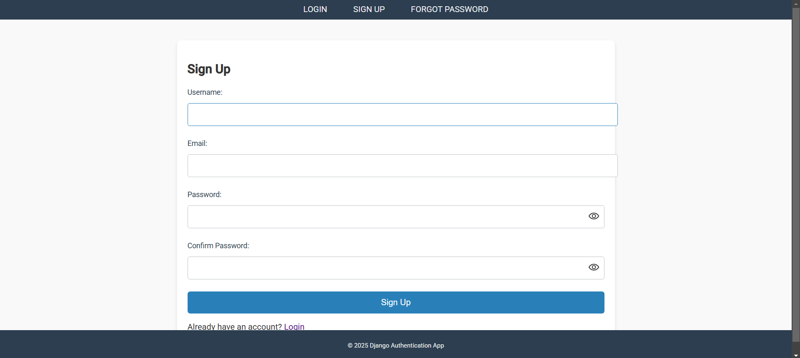
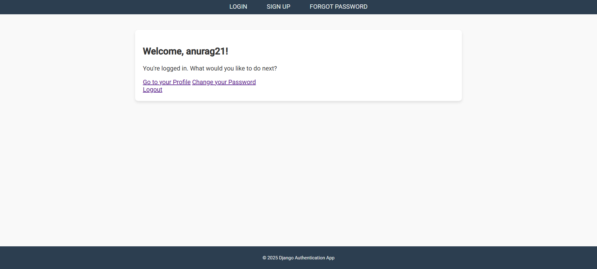
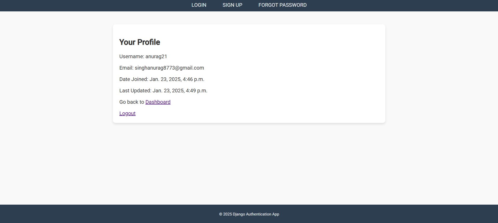
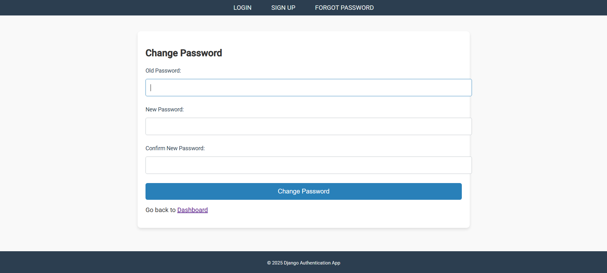
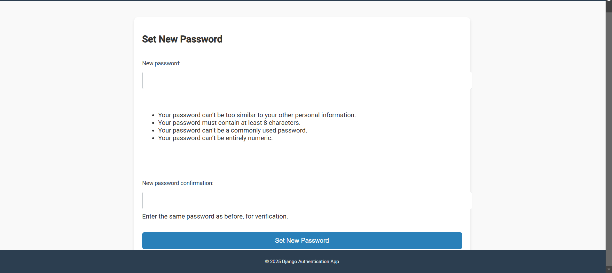

# User Authentication System

This repository contains a robust user authentication system built using Django. It includes features such as login, signup, password reset, email verification, and profile management, ensuring a secure and user-friendly experience.

## Features

- **User Registration**: Allows users to sign up with a custom user creation form.
- **Login & Logout**: Secure authentication with error handling for invalid credentials.
- **Password Reset**: Users can reset their passwords via email.
- **Change Password**: Authenticated users can update their passwords.
- **Dashboard**: A personalized dashboard for logged-in users.
- **Profile Management**: Users can view and manage their profile details.
- **Email Notifications**: Integrated email system for password reset and account-related notifications.

## Project Structure

```
user_authentication/
├── accounts/
│   ├── templates/
│   │   ├── accounts/
│   │   │   ├── login.html
│   │   │   ├── signup.html
│   │   │   ├── dashboard.html
│   │   │   ├── profile.html
│   │   │   ├── forgot_password.html
│   │   │   ├── password_reset.html
│   │   │   ├── password_reset_email.html
│   │   │   ├── password_reset_confirm.html
│   │   │   ├── password_reset_done.html
│   │   │   └── password_reset_complete.html
│   ├── forms.py
│   ├── urls.py
│   ├── views.py
│   └── models.py
├── user_authentication/
│   ├── settings.py
│   ├── urls.py
│   └── wsgi.py
└── manage.py
```

## Setup Instructions

1. Clone the repository:
   ```bash
   git clone https://github.com/yourusername/user-authentication.git
   cd user-authentication
   ```

2. Install dependencies:
   ```bash
   pip install -r requirements.txt
   ```

3. Apply migrations:
   ```bash
   python manage.py migrate
   ```

4. Create a superuser for admin access:
   ```bash
   python manage.py createsuperuser
   ```

5. Run the development server:
   ```bash
   python manage.py runserver
   ```

6. Access the application at:
   [http://localhost:8000](http://localhost:8000)

## Screenshots

### Login Page


### Signup Page


### Dashboard


### Profile


### Change Password


### Password Reset


## Demo Video

[Watch Demo Video](screenshots/User_Authentication_System.mp4)

## Logic & Implementation

### Login
- Validates user credentials using `authenticate()`.
- Redirects authenticated users to the dashboard.
- Displays error messages for invalid credentials.

### Signup
- Uses a custom user creation form.
- Validates form data and saves the user.
- Displays success or error messages based on the form validation.

### Password Reset
- Utilizes Django's built-in `PasswordResetView`.
- Sends a reset link to the user's registered email.
- Provides feedback on email sent or errors.

### Change Password
- Uses `PasswordChangeForm` to validate and update passwords.
- Ensures the session remains active after a password change.

### Email Notifications
- Configured using Django's `send_mail` function.
- Custom email templates for a professional look.

## Best Practices

- **Security**: Uses Django's secure authentication mechanisms and token-based password reset.
- **Error Handling**: Displays user-friendly error messages for all scenarios.
- **Modularity**: Follows Django's app structure for separation of concerns.
- **Scalability**: The project is designed to accommodate future features with minimal changes.
- **Customizability**: Templates and views are easily customizable for different use cases.

## Challenges Faced

- **Email Configuration**: Ensuring emails are sent reliably during development.
- **Reverse URL Issues**: Debugging `NoReverseMatch` errors for password reset links.
- **Token Expiry**: Managing token validity for secure password reset.

## Future Improvements

- Add two-factor authentication for enhanced security.
- Implement social login options (e.g., Google, Facebook).
- Improve UI/UX for a better user experience.


---

For any issues or contributions, please feel free to raise an issue or submit a pull request.

